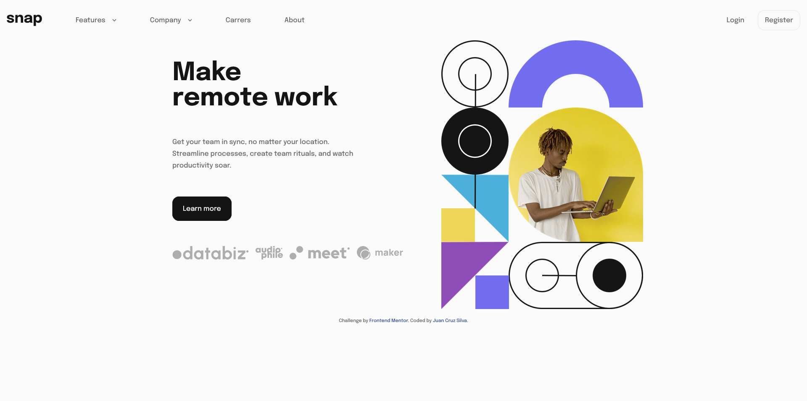

### The challenge

Users should be able to:

- View the relevant dropdown menus on desktop and mobile when interacting with the navigation links
- View the optimal layout for the content depending on their device's screen size
- See hover states for all interactive elements on the page

### Screenshot

### Links

- Solution URL: [Add solution URL here](https://github.com/JuaniSilva/Intro-Section-FEM)
- Live Site URL: [Add live site URL here](https://juanisilva.github.io/Intro-Section-FEM/)

## My process

### Built with

- Semantic HTML5 markup
- CSS custom properties
- Flexbox
- Mobile-first workflow
- [TailwindCss](https://tailwindcss.com/) - For styles

### What I learned

I did this challenge because I'm building another project and wanted to practice my dropdowns :)

## Author

- Github - [Juan Cruz Silva](https://github.com/JuaniSilva)
- Frontend Mentor - [@JuaniSilva](https://www.frontendmentor.io/profile/JuaniSilva)

